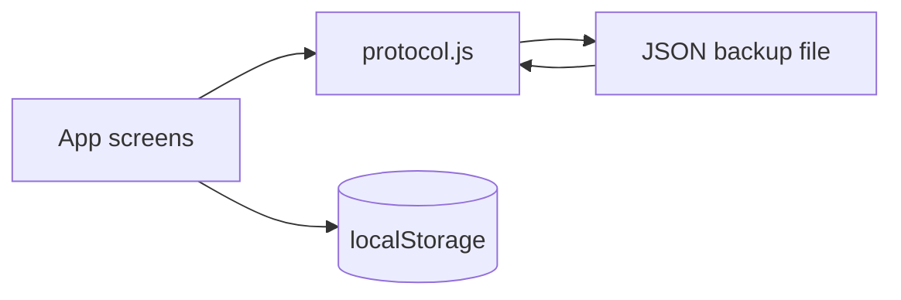

# Anxiety Thoughts Collector SLC1 — Technical Design

**Task ID:** `anxiety-thoughts-collector-slc1`  
**Date:** 2026-08-15  
**Consumes:** approved PRD (`PROCEED_WITH_EYES_OPEN`), AC-01…AC-19  
**Does not:** re-run ProductMind scoring

## 设计目标

在个人设备上交付一条完整 SLC：分流 →（内耗停手 | 恐惧/范围/A·B·C/不可控 → Review 红叉）→ 本地保存 → 列表筛选与回填 → 过关清单 → JSON 备份恢复。无账号、无后端、无原生商店。

## 当前系统观察

已有 Vite + React 19 单页原型：`src/App.jsx` 屏幕状态机、`localStorage`、中英 `i18n`、顶栏备份弹层。正式开发将协议规则抽到 `src/protocol.js`，供 UI 与 harness L2/L3 共用，避免「只在 JSX 里才正确」。

## 方案概览

- **客户端唯一进程。** 构建产物为静态站点；开发用 Vite，发布可用任意静态托管或 `vite preview`。
- **权威数据：** `localStorage[nianyun-prototype-v1]` = `{ thoughts, wins }`。
- **抗清浏览数据：** 不依赖 IndexedDB；用户经顶栏导出 JSON，事后导入替换（AC-17/18）。
- **协议内核：** `protocol.js` 负责状态分类、表单闸门、备份校验、念头→过关映射。

## 模块与边界

| 模块 | 路径 | 职责 | 不负责 |
|---|---|---|---|
| UI 状态机 | `src/App.jsx` | 屏幕、文案、导入导出 DOM | 协议对错 |
| 协议 | `src/protocol.js` | AC 闸门、filter、backup parse | 渲染 |
| 文案 | `src/i18n.js` | zh/en | 用户内容翻译 |
| 样式 | `src/styles.css` | 治愈风 token | 业务规则 |
| QA | `scripts/qa_*.mjs` | L2/L3 | 浏览器 E2E |

**错误处理：** 非法备份 → 不写 storage，提示 `importBad`。表单闸门失败 → 主按钮 disabled。导入确认取消 → no-op。

## 数据 / 状态 / 接口变化

无 HTTP API。念头字段：`kind`, `body`/`note`, `fears[]`, `scope`, `plans{a,b,c}`, `uncontrollables[]`, `outcomeText`, `outcomeVsFear`, `linkedWinId`。  
备份文件：`{ app, version, exportedAt, thoughts, wins }`。

## 前端技术边界

- 栈：React 19 + Vite 7。不引入路由库、不引入后端。
- 视口：390px 画框；≤430px 铺满。
- 语言：顶栏中/EN；备份按钮并列。
- Deferred：PWA 插件、Capacitor、云同步、AI。

## AC Traceability Matrix

| AC-ID | PRD 摘要 | 设计章节 | 计划测试证据 |
|---|---|---|---|
| AC-01 | 首页不铺列表，记下+已有念头 | UI 规格 §2 Home | L3 文档走查；构建 |
| AC-02 | 先分流 | App `gate` | L3 journey 文档；手动 |
| AC-03 | 内耗成功+留痕 | `ruminationRecord` | L2 `qa_protocol_smoke` |
| AC-04 | 内耗改推进 | Detail convert | L3 journey |
| AC-05 | 念头正文必填 | `canAdvanceBody` | L2 |
| AC-06 | 恐惧 1–5 | `canAdvanceFears`/`canAddFear` | L2 |
| AC-07 | 范围必选 | `canAdvanceScope` | L2 |
| AC-08 | A/B/C 必填 | `canAdvancePlans` | L2 |
| AC-09 | Review 红叉 | App `review` + ui-spec | L3 手动/走查 |
| AC-10 | 保存空 outcome | `progressRecord` | L2 |
| AC-11 | 编辑+结果三选一 | Detail | L3 手动 |
| AC-12 | 胜利三字段 | win-form | L3 手动 |
| AC-13 | 详情去过关 | Detail CTA | 走查 |
| AC-14 | 免责+手机宽 | Home footer / CSS | 走查 |
| AC-15 | 已有念头入口 | `thought-list` | 走查 |
| AC-16 | 收入过关不重复 | `linkThoughtToWin` | L3 journey |
| AC-17 | 顶栏备份导出 | topbar + `buildBackup` | L2 roundtrip |
| AC-18 | 导入替换 | `parseBackupText` | L2 |
| AC-19 | 状态筛选 | `filterThoughts` | L2 |

## 测试与验证（harness.config）

- **L1** `npm run build`
- **L2** `node scripts/qa_protocol_smoke.mjs`
- **L3** `node scripts/qa_user_journey_smoke.mjs`
- 无外部 API；无 L4。浏览器点击路径由用户自测（H1–H4），不阻塞本 gate。

## 实现步骤

1. 抽出 `protocol.js`，UI 改为调用闸门函数。  
2. 引语去句号；备份入口在顶栏弹层（已产品确认）。  
3. 补 AC-17…19 测试脚本与 `harness.config.json`。  
4. `harness_verify.py --mode verify --scope all`。

## 风险与回滚

- iOS 导出可能进入预览而非直接「文件」：文案已提示。回滚：去掉导入不影响捕获回路。  
- localStorage 仍会在清网站数据时丢失：这是已知产品选择，用 JSON 备份补。  
- 回滚构建：静态 `dist` 上一版即可。

## 是否可进入可行性 gate

**可以。** 无 P0；无外部依赖；AC 均可测。
